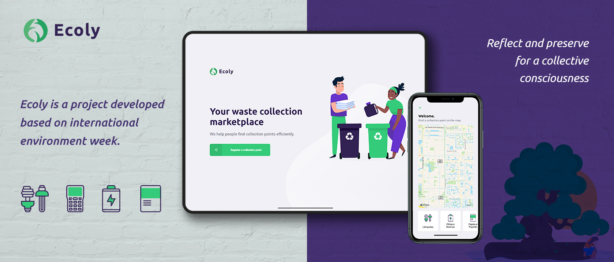

<h1 align="center">
    
</h1>

<h4 align="center">
  🌳 Reflect and preserve for a collective consciousness 🌳
</h4>

<p align="center">
  

  
	
  <a href="https://www.linkedin.com/in/viniciumedeiros/">
    
  </a>
  
  <a href="https://github.com/viniciumedeiros/ecoly/commits/master">
    
  </a>

  
   <a href="https://github.com/viniciumedeiros/ecoly/stargazers">
    
  </a>
</p>
<p align="center">
<a href="https://insomnia.rest/run/?label=Ecoly&uri=https%3A%2F%2Fraw.githubusercontent.com%2Fviniciumedeiros%2Fecoly%2Fmaster%2Fbackend%2FInsomnia.json" target="_blank"></a>
</p>
<p align="center">
  <a href="#-project">Project</a>&nbsp;&nbsp;&nbsp;|&nbsp;&nbsp;&nbsp;
  <a href="#-technologies">Technologies</a>&nbsp;&nbsp;&nbsp;|&nbsp;&nbsp;&nbsp;
  <a href="#-how-to-use">How to use</a>&nbsp;&nbsp;&nbsp;|&nbsp;&nbsp;&nbsp;
  <a href="#-how-to-contribute">How to contribute</a>&nbsp;&nbsp;&nbsp;|&nbsp;&nbsp;&nbsp;
  <a href="#-license">License</a>
</p>

## 💻 Project

Ecoly is a project developed based on international environment week. 
The project aims to establish a connection between companies and / or entities that collect waste (organic and inorganic) to people and / or entities that constantly need to dispose of this waste. Solving a major recurring problem that is the inappropriate disposal of garbage, facilitating the process of recycling and reuse.

<h1 align="center">
    
</h1>


## 🚀 Technologies

This project was developed with the following technologies:

- [Node.js][nodejs]
- [TypeScript][typescript]
- [React][reactjs]
- [React Native][rn]
- [Expo][expo]

## 🌍 How To Use

To clone and run this application, you'll need [Git](https://git-scm.com), [Node.js][nodejs] + [Yarn][yarn] installed on your computer.

From your command line:

### Install API 

```bash
# Clone this repository
$ git clone https://github.com/viniciumedeiros/ecoly

# Go into the repository
$ cd ecoly/backend

# Install dependencies
$ yarn install

# Run Migrates
$ yarn knex:migrate

# Run Seeds
$ yarn knex:seed

# Start server
$ yarn dev

# running on port 3333
```

### Install Front-end

```bash
# Clone this repository
$ git clone https://github.com/viniciumedeiros/ecoly

# Go into the repository
$ cd ecoly/frontend

# Install dependencies
$ yarn install

# Run
$ yarn start

# running on port 3000
```

### Install Mobile

```bash
# Clone this repository
$ git clone https://github.com/viniciumedeiros/ecoly

# Go into the repository
$ cd ecoly/mobile

# Install dependencies
$ yarn install

# Run
$ yarn start

# Expo will open, just scan the qrcode on terminal or expo page

# If some problem with fonts, execute:
$ expo install expo-font @expo-google-fonts/ubuntu @expo-google-fonts/roboto

```

## 👽 How to contribute

-  Make a fork;
-  Create a branck with your feature: `git checkout -b my-feature`;
-  Commit changes: `git commit -m 'feat: My new feature'`;
-  Make a push to your branch: `git push origin my-feature`.

After merging your receipt request to done, you can delete a branch from yours.

## 📃 License

This project is under the MIT license. See the [LICENSE](https://github.com/viniciumedeiros/ecoly/blob/master/LICENSE) for details.

Made with by Vinícius Medeiros 🐱‍👤 [Get in touch!](https://www.linkedin.com/in/viniciumedeiros/)

[nodejs]: https://nodejs.org/
[typescript]: https://www.typescriptlang.org/
[expo]: https://expo.io/
[reactjs]: https://reactjs.org
[rn]: https://facebook.github.io/react-native/
[yarn]: https://yarnpkg.com/